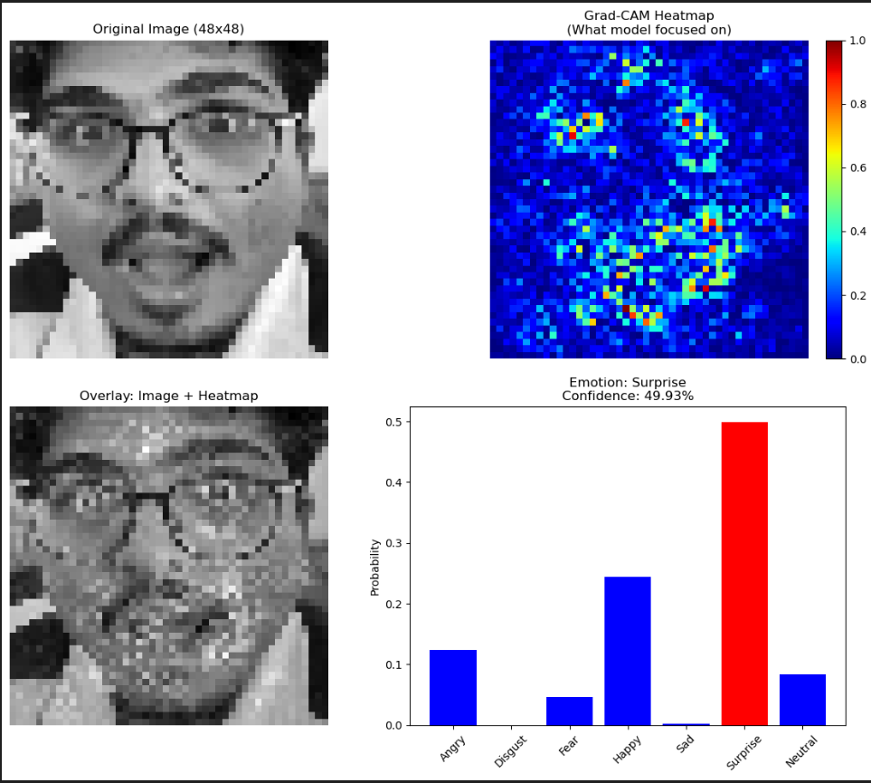

# Facial Emotion Detection

A deep learning project that detects and classifies human facial emotions in real-time using a Convolutional Neural Network (CNN) trained on the FER2013 dataset.

## Overview

This project classifies facial expressions into 7 emotion categories:

`Angry` · `Disgust` · `Fear` · `Happy` · `Sad` · `Surprise` · `Neutral`

The model uses a CNN trained on the FER2013 dataset (~35,000 grayscale images) and runs real-time inference via webcam using OpenCV.



## Project Structure

```
AI_SEM5/
├── EmotionDetector.ipynb     # Model training notebook
├── FaceEmotionTest.ipynb     # Testing and evaluation notebook
├── face.ipynb                # Face detection experiments
├── main.py                   # Real-time webcam inference script
├── emotion_detector/         # Supporting module
└── requirements.txt          # Dependencies
```

## Model Weights

The trained model weights (`.h5`) are too large for GitHub and are hosted externally.

📥 **[Download Model Weights (Google Drive)](https://drive.google.com/drive/folders/1SR_7oHLk9clzlZeaEhHHAYy6euUrOTYJ?usp=sharing)**

After downloading, place the `.h5` file in the root directory before running inference.

## Setup

```bash
git clone https://github.com/KapurPandey/AI_SEM5.git
cd AI_SEM5
pip install -r requirements.txt
```

## Usage

**Real-time webcam detection:**
```bash
python main.py
```

**Training / Evaluation:**

Open `EmotionDetector.ipynb` in Jupyter and run all cells. Make sure the model weights are downloaded before running `FaceEmotionTest.ipynb`.

## Tech Stack

- Python
- TensorFlow / Keras
- OpenCV
- NumPy, Matplotlib, Pandas

## Dataset

[FER2013](https://www.kaggle.com/datasets/msambare/fer2013) — ~35,000 grayscale 48×48 images across 7 emotion classes.
